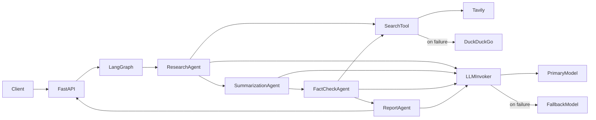

# Multi-Agent Research Assistant

A FastAPI + LangGraph system that generates comprehensive research reports on any topic using four coordinated AI agents.

## Features

- **Research Agent** — searches the web, extracts findings and references
- **Summarization Agent** — deduplicates and organizes information
- **Fact-Checking Agent** — cross-references claims against multiple sources
- **Report Generation Agent** — produces a structured final report
- **Tavily-first search** with **DuckDuckGo fallback** when Tavily fails
- **Primary OpenAI model** with **automatic fallback model** on transient API failures
- **LangSmith tracing** (optional) for observability

## Architecture



### Agent Workflow

1. **Research** — runs Tavily (or DuckDuckGo fallback) searches on the topic and LLM-generated sub-queries; extracts raw notes, URLs, and findings.
2. **Summarization** — processes research output into a structured summary with main points and observations.
3. **Fact-Check** — extracts verifiable claims, cross-searches each claim, assigns confidence scores and verification status.
4. **Report** — synthesizes all prior outputs into the final structured report.

## Fallback Systems

The project uses two independent fallback layers so agents stay resilient without local error handling.

### 1. Search fallback (`app/tools/search.py`)

All web searches go through a single `search()` function used by the Research and Fact-Check agents.

| Step | Provider | When |
|------|----------|------|
| Primary | **Tavily** | Default for every query |
| Fallback | **DuckDuckGo** | Tavily fails (missing key, API error, timeout, empty results) |
| Failure | `SearchError` → HTTP **502** | Both providers fail for the same query |

Deduplicated results are normalized to the same shape (`title`, `url`, `content`) regardless of provider. The response field `search_providers_used` shows which providers served results (e.g. `["tavily"]` or `["duckduckgo"]`).

### 2. LLM fallback (`app/agents/llm.py`)

All agent LLM calls go through a single `invoke_structured()` helper.

| Step | Model | When |
|------|-------|------|
| Primary | `OPENAI_MODEL` (default `gpt-4o-mini`) | Default for every structured LLM call |
| Fallback | `OPENAI_FALLBACK_MODEL` (default `gpt-4o`) | Primary model hits a transient API error |
| Failure | `LLMError` → HTTP **503** | Both models fail for the same call |

Fallback is triggered only for **main transient errors**: connection failures, timeouts, rate limits (429), server errors (5xx), and model-not-found (404). Auth errors (401/403) fail immediately without retrying.

Agents do not contain their own `try/except` blocks — fallback logic is centralized here.

### Error handling summary

| Status | Error | Meaning |
|--------|-------|---------|
| 422 | Validation | Invalid request (e.g. topic too short) |
| 500 | `ValueError` | Configuration error (e.g. missing `OPENAI_API_KEY`) |
| 502 | `SearchError` | Both Tavily and DuckDuckGo failed |
| 503 | `LLMError` | Both primary and fallback OpenAI models failed |

## Setup

### Prerequisites

- Python 3.10+
- OpenAI API key
- Tavily API key (optional but recommended; DuckDuckGo is used as fallback)

### Installation

```bash
cd AI_Research_Agent
python3 -m venv .venv
source .venv/bin/activate
pip install -r requirements.txt
cp .env.example .env
```

Edit `.env` and set your keys:

```
OPENAI_API_KEY=sk-...
TAVILY_API_KEY=tvly-...
OPENAI_MODEL=gpt-4o-mini
OPENAI_FALLBACK_MODEL=gpt-4o

# Optional: LangSmith tracing
LANGSMITH_TRACING=true
LANGSMITH_API_KEY=lsv2_...
LANGSMITH_PROJECT=ai-research-agent
```

### Run the Server

```bash
uvicorn app.main:app --reload
```

API docs: http://127.0.0.1:8000/docs

## API Documentation

### `GET /api/v1/health`

Health check.

**Response:**
```json
{ "status": "ok" }
```

### `POST /api/v1/research`

Generate a research report for a topic.

**Request:**
```json
{
  "topic": "Impact of Generative AI on Software Development"
}
```

**Response:**
```json
{
  "topic": "Impact of Generative AI on Software Development",
  "executive_summary": "...",
  "key_findings": ["..."],
  "supporting_evidence": ["..."],
  "fact_check_results": [
    {
      "claim": "...",
      "status": "verified",
      "confidence": 0.85,
      "notes": "..."
    }
  ],
  "references": ["https://..."],
  "conclusion": "...",
  "search_providers_used": ["tavily"]
}
```

**cURL example:**
```bash
curl -X POST http://127.0.0.1:8000/api/v1/research \
  -H "Content-Type: application/json" \
  -d '{"topic": "Impact of Generative AI on Software Development"}'
```

### Error Responses

| Status | Cause |
|--------|-------|
| 422 | Invalid request (e.g. topic too short) |
| 500 | Missing or invalid configuration (e.g. `OPENAI_API_KEY`) |
| 502 | Both Tavily and DuckDuckGo search failed |
| 503 | Both primary and fallback OpenAI models failed |

## Project Structure

```
app/
├── main.py              # FastAPI application
├── config.py            # Settings, LLM factories, LangSmith setup
├── exceptions.py        # AgentError, LLMError
├── api/
│   ├── routes.py        # API endpoints
│   └── schemas.py       # Request/response models
├── agents/
│   ├── state.py         # LangGraph state definition
│   ├── graph.py         # Workflow graph
│   ├── llm.py           # invoke_structured() with OpenAI fallback
│   ├── research.py      # Research agent node
│   ├── summarization.py # Summarization agent node
│   ├── fact_check.py    # Fact-checking agent node
│   └── report.py        # Report generation agent node
└── tools/
    └── search.py        # Tavily + DuckDuckGo search fallback
samples/                 # Example generated reports
```

## Assumptions

- **Search fallback**: Tavily is primary; DuckDuckGo is used automatically per-query when Tavily fails.
- **LLM fallback**: Primary model is tried first; fallback model handles transient OpenAI API failures only.
- **Centralized errors**: Agents delegate to `search()` and `invoke_structured()`; routes map main errors to HTTP status codes.
- **No vector DB**: All context is passed through LangGraph state between agents.
- **Sync API**: Research runs synchronously in the request handler (typical run: 1–3 minutes).
- **Models**: Defaults to `gpt-4o-mini` (primary) and `gpt-4o` (fallback); both configurable via `.env`.
- **Citations**: Agents are instructed to cite only URLs returned by search results.
- **No auth**: API is open; add authentication for production use.

## Sample Outputs

Pre-generated reports are available in [`samples/`](samples/):

- [`generative_ai_report.json`](samples/generative_ai_report.json) — Impact of Generative AI on Software Development
- [`renewable_energy_report.json`](samples/renewable_energy_report.json) — Renewable Energy Adoption in Developing Countries

To regenerate samples:

```bash
PYTHONPATH=. python scripts/generate_samples.py
```

